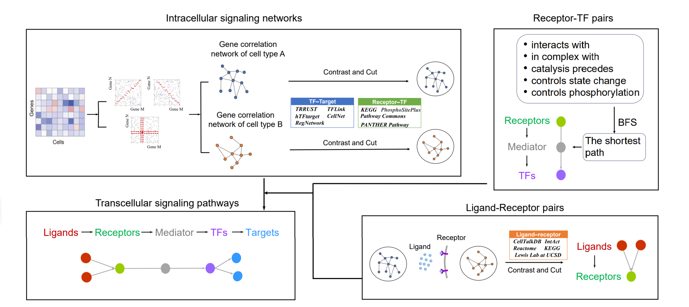

# CellsigN
CellSigN, a computational framework for reconstructing complete “ligand–receptor–mediator–TF–target” signaling pathways. CellSigN integrates ligand–receptor interactions, transcriptional regulation, and six types of intracellular signal transduction.

As shown in figure, CellSigN begins by constructing cell type–specific gene correlation networks from scRNA-seq data and corresponding cell annotations. It then applies a contrastive-cutting strategy to integrate known TF–target (TF–TG) and receptor–TF interactions, curated from multiple databases, with these correlation networks to generate intracellular signaling subnetworks. By incorporating five major categories of molecular interactions—physical association, complex formation, catalytic regulation, state modulation, and phosphorylation—CellSigN identifies the molecular roles within each subnetwork and classifies them as receptors, intermediate mediators, or TF. The shortest receptor–TF paths are subsequently determined using a breadth-first search (BFS) algorithm, enabling the connection of ligands in sender cells to TF in receiver cells through receptor–mediator–TF cascades. Known ligand–receptor pairs are then mapped onto the cell type–specific networks. Integrating both intracellular and intercellular components, CellSigN ultimately reconstructs complete cross-cell signaling pathways that encompass the ligand–receptor–mediator–TF–target continuum.
# Preparation

