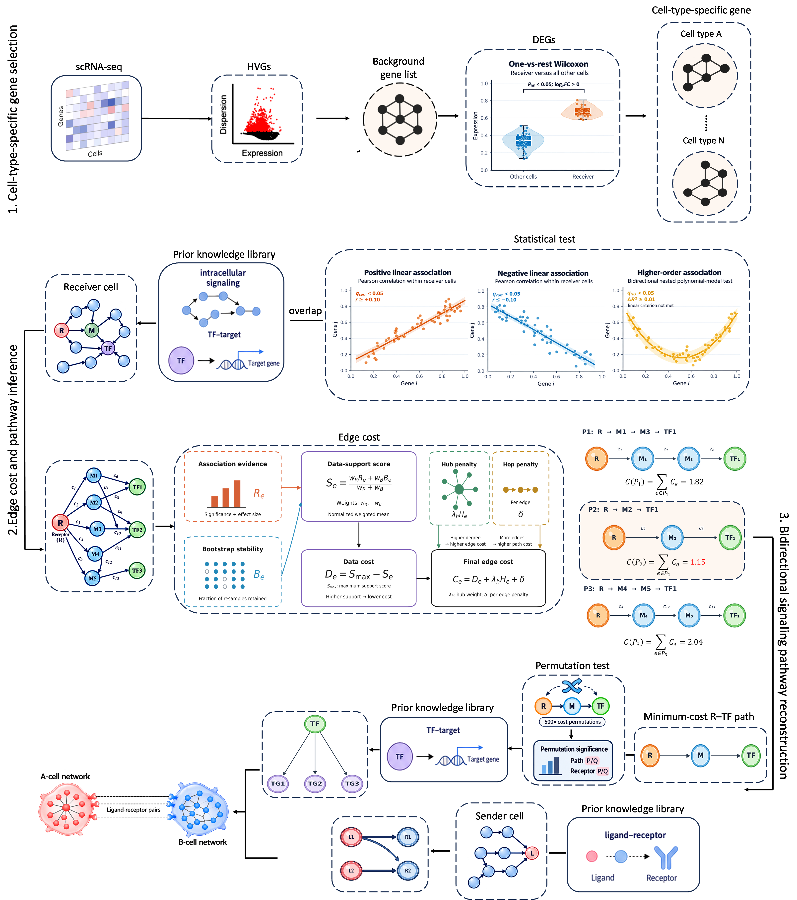

# CellSigN

CellSigN is a **mediator-aware framework for cell–cell signaling analysis**
from single-cell RNA-seq data. It connects ligand–receptor interactions to
candidate receptor-to-transcription factor routes and downstream target genes
by integrating cell-type-specific expression evidence with curated
ligand–receptor, intracellular signaling and transcription factor–target
references. Its outputs are interpretable, reference-supported signaling
hypotheses for experimental investigation.

By default, CellSigN analyzes both directions between the malignant cell type
and every other eligible cell type. Specific ordered sender–receiver pairs
can also be requested. Intracellular routes can contain explicit mediators
or directly connect a receptor to a transcription factor.

**Inputs:** an `.h5ad` file or a gene-by-cell expression table with cell labels,
plus the two bundled reference tables. **Outputs:** candidate pathway tables,
receiver-edge evidence, selected gene lists and a run manifest. The source module is
run with `python -m main`; installation also provides the `cellsign` command.

## Workflow

The workflow follows the three stages illustrated in **Figure 2 of the
manuscript**.

1. **Cell-type-specific gene selection.** CellSigN filters cells and genes,
   optionally applies total-count normalization and `log1p`, and selects up to
   5,000 highly variable genes (HVGs). Each eligible cell type is compared once
   with all remaining cells using a one-versus-rest Wilcoxon test. All genes
   with a positive approximate log2 fold change and a raw p-value below
   `--de-threshold` are designated as DE genes and retained without an upper
   limit. If fewer than `--de-gene-target` genes qualify (500 by default),
   additional HVGs with finite raw p-values above the DE threshold are added
   in ascending p-value order until the target is reached or the eligible
   pool is exhausted. When the tested universe contains no more than the
   target number of genes, all tested genes are retained. Supplementary genes
   need not have positive fold changes and are recorded separately from DE
   genes. This broadens the candidate universe when DE testing has limited
   power, including in cell types with small cell counts. These selected gene
   sets are reused across ordered signaling directions.

2. **Receiver-specific network construction and pathway inference.**
   Pearson correlation and bidirectional nested linear-versus-cubic model
   tests evaluate linear and higher-order associations among selected receiver
   genes. BH-adjusted significance and effect-size criteria determine which
   associations are retained. Statistically supported edges are intersected
   with the intracellular signaling prior to form the path-search graph;
   prior annotations determine permitted traversal directions and receptor/TF
   roles. Association evidence and bootstrap stability contribute to edge
   costs, together with hub and per-edge hop penalties. For each eligible
   receptor–TF pair, CellSigN retains up to `--k-paths` lowest-cost simple
   routes and evaluates the minimum route cost by edge-cost permutation.
   Hub degrees are calculated in the undirected statistical network before
   intersection with the prior.

3. **Transcellular pathway assembly.** Retained intracellular routes are
   linked to eligible sender-cell ligands and receiver-cell target genes
   through curated ligand–receptor and TF–target relationships. The resulting
   **ligand → receptor → mediator(s) → transcription factor → target gene(s)**
   hypotheses connect extracellular communication with candidate intracellular
   routes and transcriptional regulation. A-to-B and B-to-A directions are
   analyzed independently.



**Figure 2 | Overview of the CellSigN framework.** Expression evidence and
curated interaction priors support receiver-specific network construction,
edge-cost calculation and candidate receptor-to-TF route selection. Sender
ligands and receiver target genes are attached to assemble transcellular
signaling hypotheses. Path costs and thresholds in the schematic illustrate
the manuscript settings; the number of retained routes and other settings
can be configured. HVG, highly variable gene; DEG, differentially expressed
gene; L, ligand; R, receptor; M, mediator; TF, transcription factor; TG, target
gene.

The [command-line guide](README_COMMAND_LINE_GUIDE.md) shows one-stage and
separate `evidence`/`paths` runs. A `paths` run reuses saved evidence rather
than recalculating receiver statistics.

## Quick start

Use Python 3.9 or newer. Extract the repository archive and run these commands
from its top-level directory. In an existing compatible environment, skip the
virtual-environment creation and activation commands.

Windows CMD:

```cmd
python -m venv .venv
.venv\Scripts\activate
python -m pip install -e .
```

Linux/macOS:

```bash
python3 -m venv .venv
source .venv/bin/activate
python -m pip install -e .
```

The following **small synthetic smoke test** uses files in `tests/data/` and
works as one line in Windows CMD, PowerShell or Bash:

```text
python -m main --stage all --expression tests/data/expression.tsv --cell-path tests/data/cell_types.tsv --intracellular-prior tests/data/intracellular_prior.tsv --ligand-receptor-prior tests/data/ligand_receptor.tsv --pair Sender:Receiver --stability-resamples 0 --path-permutations 5 --output-dir Results_smoke
```

A successful run ends with `CellSigN stage 'all' completed.` and writes
`Results_smoke_expression/Sender_to_Receiver_pathway.txt`. This synthetic
fixture checks installation and execution; it is not a biological case study.
To run the automated test suite, install `.[test]` and execute `pytest`.

## Run the included Chung breast cancer example

`Example data/` contains a processed **515-cell × 5,000-gene** expression
matrix and matching cell labels derived from the primary breast cancer dataset
of Chung et al. (2017), available from GEO as
[GSE75688](https://www.ncbi.nlm.nih.gov/geo/query/acc.cgi?acc=GSE75688).
The table exports the `X` matrix of the processed h5ad used for analysis;
it is **not** the original GEO raw matrix. Checksums for the supplied files are
listed in [SHA256SUMS](SHA256SUMS).

Run the supplied text export with the two bundled reference tables:

```text
python -m main --stage all --expression "Example data/Data_Chung2017_Breast_all_expression.txt" --cell-path "Example data/Data_Chung2017_Breast_all_cell_labels.txt" --intracellular-prior reference_data/human/intracellular_network.txt.gz --ligand-receptor-prior reference_data/human/ligand_receptor.txt --malignant-label Malignant --no-normalize --no-log1p --de-threshold 0.05 --k-paths 1 --path-permutations 500 --seed 42 --output-dir Results
```

The results are written under `Results_Data_Chung2017_Breast_all_expression/`.
This real-data run is more computationally demanding than the smoke test.
`Example Result/` contains historical B-cell-to-malignant and
malignant-to-B-cell pathway tables from an earlier run on the processed h5ad.
These tables include the legacy `Edge_Sources` column and are not an exact
output template for the current implementation. Use the files generated by
the command above to inspect current outputs. Text and h5ad representations
may yield small numerical differences; historical rows are not guaranteed
to be reproduced exactly. These tables are candidate associations, not
experimentally validated signaling paths.

## Use your own data

- For `.h5ad`, cells are rows and genes are columns. Cell labels must be in
  `adata.obs`; the default column is `celltype`, configurable with
  `--cell-type-column`.
- For a delimited text matrix, genes are rows, cells are columns and the first
  column contains gene identifiers. Supply `--cell-path` with a two-column
  cell-ID/cell-type file; its first row may be a header.
- Normalization and `log1p` are enabled by default. Use `--no-normalize` and
  `--no-log1p` when the input values are already processed and should be used
  unchanged.

The intracellular reference is bundled as
`reference_data/human/intracellular_network.txt.gz`. CellSigN reads it
directly; decompression is unnecessary. The ligand–receptor reader uses the
first two columns of `reference_data/human/ligand_receptor.txt` and does not
apply a score threshold because this supplied table is already curated.
Checksums for the supplied reference tables are listed in
[SHA256SUMS](SHA256SUMS).

## Read the results

CellSigN appends the expression filename to `--output-dir`, creating a folder
such as `Results_Data_Chung2017_Breast_all_expression/`. Its key contents are:

| File or directory | Contents |
|---|---|
| `<Sender>_to_<Receiver>_pathway.txt` | Candidate L–R–M–TF–TG pathways for one ordered cell direction |
| `gene_lists/` | Selected DE and supplementary genes by cell type, with `Selection_Source` labels |
| `evidence/` | Full DE and receiver-edge evidence, path edges and R–M–TF subnetworks |
| `other/differential_gene_counts.txt` | DE, supplementary and total selected gene counts per eligible cell type |
| `other/test_counts.txt` | Per-direction counts of tested pairs and permutations |
| `other/run_manifest.json` | Input hashes, parameters, software versions and output counts |

The `*_de_genes.txt` filenames are retained for compatibility; their rows may
include supplementary genes. `Selection_Source` is `DE` for qualifying DE
genes, `p_value_supplement` for genes added by p-value order, or
`all_genes_below_target` for non-DE genes retained when the tested universe is
no larger than the supplementation target. Supplementary genes are not
additional statistically significant DE genes.

The first five pathway columns are `Ligand`, `Receptor`, `Mediator`, `TF` and
`Target`. **Each row represents one intracellular R–M–TF path.** Commas in
`Mediator` list sequential nodes in path order; a direct R–TF path has no
mediator. Commas in `Ligand` or `Target` list alternative partners attached to
that same intracellular path.

`Path_P`/`Path_Q` are R–TF pair-level permutation results for the minimum
route cost. Alternative routes for the same R–TF pair share these statistics.
`Receptor_P`/`Receptor_Q` evaluate the best reachable TF for a receptor.
`Receptor_Significant` compares `Receptor_Q` with `--path-alpha`. These
statistics are reported, but nonsignificant pathways are not automatically
deleted. They do not provide a joint p-value for the complete
ligand–receptor–mediator–TF–target cascade or separately test the attached
ligands and target genes.

## Main options and reproducibility

| Option | Default | Effect |
|---|---:|---|
| `--stage` | `all` | Run both stages, only `evidence`, or only `paths` |
| `--malignant-label` | `Malignant` | Label used for the default malignant↔other scope |
| `--pair` | none | Analyze one ordered `SENDER:RECEIVER` pair; repeat to select more |
| `--hvg-top-genes` | 5000 | Maximum number of globally selected HVGs |
| `--de-threshold` | 0.05 | Raw one-versus-rest Wilcoxon p-value cutoff |
| `--de-gene-target` | 500 | Target for supplementing small DE sets; larger DE sets are never truncated; `0` disables supplementation |
| `--alpha` | 0.05 | BH-adjusted Pearson and nonlinear edge-test cutoff |
| `--stability-resamples` | 20 | Receiver-cell bootstrap iterations |
| `--k-paths` | 5 | Lowest-cost paths retained per R–TF pair |
| `--path-permutations` | 500 | Edge-cost permutations; `0` disables them |
| `--path-alpha` | 0.05 | Receptor-q threshold for the significance flag |
| `--seed` | 0 | Random seed |

Use `python -m main --help` for all options, including the cost weights.
Cell types with fewer than five retained cells are excluded from sender and
receiver roles; their cells remain in the background population for
one-versus-rest comparisons. Each comparison also requires at least five
background cells. The run manifest records the exact inputs,
hashes, settings and software versions needed to assess
reproducibility. CellSigN reports **association-supported candidate paths**;
differential expression, statistical association and permutation tests do not
by themselves establish causal signaling. Independent biological validation
is required for causal claims.

The source code is distributed under [GPL-3.0](LICENSE). The bundled reference
tables may also be subject to their upstream sources' terms.
